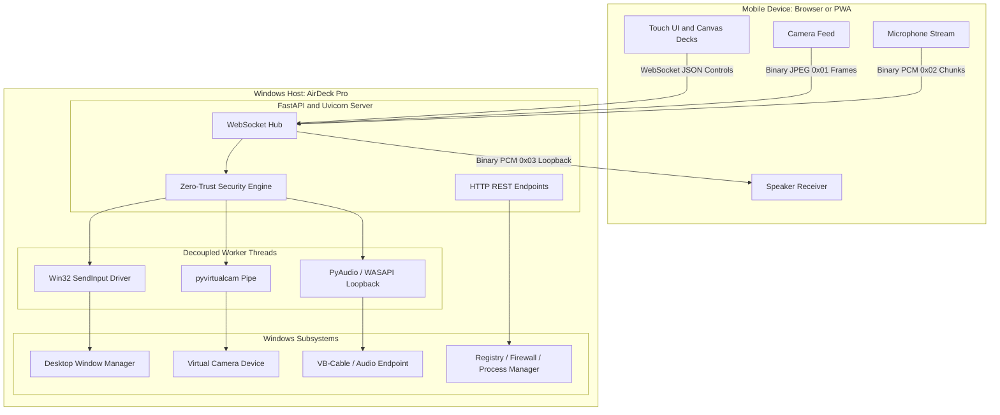

# AirDeck Pro

Wireless Hardware Companion Bridge and Modular Controller Suite for Windows

AirDeck Pro is an open-source, ultra-low-latency companion system that transforms any modern smartphone or tablet into a wireless hardware controller for Windows PCs and laptops. It operates without requiring any third-party mobile application from the Google Play Store or Apple App Store. The entire client interface runs directly inside your mobile browser as a responsive, installable Progressive Web App (PWA) communicating over local Wi-Fi or mobile hotspot.

---

## Table of Contents

1. [Project Overview](#project-overview)
2. [Key Capabilities](#key-capabilities)
3. [Architecture and Design](#architecture-and-design)
4. [Prerequisites and System Requirements](#prerequisites-and-system-requirements)
5. [Installation and Getting Started](#installation-and-getting-started)
   - [Method 1: Standalone Windows Installer (Recommended)](#method-1-standalone-windows-installer-recommended)
   - [Method 2: Running from Source Code](#method-2-running-from-source-code)
6. [Pairing and Connection Walkthrough](#pairing-and-connection-walkthrough)
   - [Step 1: Start AirDeck on PC](#step-1-start-airdeck-on-pc)
   - [Step 2: Connect Phone via QR Code or URL](#step-2-connect-phone-via-qr-code-or-url)
   - [Step 3: SSL Certificate Trust Setup](#step-3-ssl-certificate-trust-setup)
   - [Step 4: Security PIN Verification](#step-4-security-pin-verification)
7. [Deck Modules Reference](#deck-modules-reference)
   - [Deck 1: Trackpad, Gestures, and Media Remote](#deck-1-trackpad-gestures-and-media-remote)
   - [Deck 2: Macro Stream Deck and System Telemetry](#deck-2-macro-stream-deck-and-system-telemetry)
   - [Deck 3: Full Tactile Numpad](#deck-3-full-tactile-numpad)
   - [Deck 4: Presentation Remote and Stopwatch](#deck-4-presentation-remote-and-stopwatch)
8. [Hardware Audio and Video Bridge](#hardware-audio-and-video-bridge)
   - [HD Virtual Webcam](#hd-virtual-webcam)
   - [Studio Wireless Microphone](#studio-wireless-microphone)
   - [Wireless Extended Speaker (Audio Loopback)](#wireless-extended-speaker-audio-loopback)
9. [Desktop Control Panel and System Tray](#desktop-control-panel-and-system-tray)
10. [Network and Firewall Configuration](#network-and-firewall-configuration)
11. [Security Architecture](#security-architecture)
12. [API and Protocol Specification](#api-and-protocol-specification)
    - [REST HTTP Endpoints](#rest-http-endpoints)
    - [WebSocket Message Protocol](#websocket-message-protocol)
13. [Building Standalone Binaries and Installers](#building-standalone-binaries-and-installers)
14. [Repository Directory Structure](#repository-directory-structure)
15. [Troubleshooting and FAQ](#troubleshooting-and-faq)
16. [License](#license)

---

## Project Overview

AirDeck Pro addresses the friction of physical peripherals, paid macro devices, and fragmented utility software. By leveraging modern web standards (WebSockets, WebRTC media streams, Touch Events, and Progressive Web Apps) coupled with native Windows API injection, AirDeck Pro gives you:

- A full precision wireless trackpad with multi-touch click and scroll simulation.
- A customizable macro launcher similar to physical Stream Deck devices.
- A dedicated numeric keypad (Numpad) for compact laptop keyboards.
- A presentation slide clicker with built-in timing tools.
- A bi-directional hardware media bridge turning your phone into an external HD PC webcam, wireless microphone, or wireless PC speaker sink.
- Instant, secure clipboard sharing across devices.
- Hardware-accelerated, zero-dependency client delivery: no APK, no TestFlight, and no app store accounts required.

---

## Key Capabilities

### For Everyday Users

- Zero App Installation: Open the link on Chrome, Safari, Edge, or Samsung Internet, tap "Add to Home Screen", and use it full screen.
- 1-Tap QR Code Auto-Pairing: Scan the QR code displayed in the Windows terminal, system tray, or native desktop window to connect instantly.
- Daily Convenience Shortcuts: Dedicated top-bar buttons for Show Desktop (Win+D), Switch Applications (Alt+Tab), Snipping Screenshot (Win+Shift+S), Close Active Tab (Ctrl+W), and Lock Computer (Win+L with safety confirmation).
- High-Performance Trackpad: Smooth cursor movement with inertia, adaptive scrolling strip, and dedicated mouse buttons.
- Voice Typing Support: Use your phone keyboard microphone to dictate text straight into any Windows application (Word, Discord, IDEs, Browser).

### For Power Users and Developers

- Win32 Native Input Injection: Direct invocation of user32.dll SendInput with per-monitor DPI awareness and 1ms multimedia clock scheduling (winmm.timeBeginPeriod).
- Non-Blocking Concurrency: Dedicated worker threads isolate mouse, keyboard, video, and audio pipelines so that high-frequency touch packets never congest the network event loop.
- Live PC Telemetry: Real-time CPU load percentage, RAM usage metrics, and battery status transmitted directly to the client deck.
- Persistent Multi-Device Tokens: Safe pairing database ensuring you only have to verify the 4-digit PIN once per device.
- ZeroConf mDNS Resolution: Reachable via http://airdeck-[hostname].local alongside direct LAN IP binding.

---

## Architecture and Design

The following diagram illustrates how AirDeck Pro components interact across the network and host operating system:



### Concurrency and Thread Safety

1. Asyncio Event Loop: Handles WebSocket frame ingestion, TLS handshake, and REST endpoints.
2. Win32 Input Queue: Mouse delta movements and keyboard events are pushed into an in-memory queue. A dedicated background thread drains this queue and invokes the Win32 `SendInput` API, guaranteeing zero thread stalling on the network loop.
3. Media Processing Queue: Incoming camera frames and microphone audio buffers are processed on independent worker queues with bounded backpressure limits, discarding obsolete frames if network jitter occurs.

---

## Prerequisites and System Requirements

### Host PC (Windows)

- Operating System: Windows 10 or Windows 11 (64-bit).
- Python: Version 3.10, 3.11, 3.12, or 3.13 (only required if running from source code).
- Network: A local Wi-Fi network, Ethernet connected to the same router, or a Windows Mobile Hotspot.
- Optional Virtual Audio Driver: VB-Audio Virtual Cable (required only if you wish to route your phone microphone into communication apps like Discord, Zoom, or Teams).
- Optional Virtual Camera Driver: OBS Virtual Camera or Unity Capture (only required if using the phone camera as a webcam).

### Mobile Device

- Any iOS device (iPhone/iPad running iOS 14 or higher) with Safari.
- Any Android device (running Android 8.0 or higher) with Google Chrome, Edge, or Samsung Internet.
- Both PC and Mobile device must be on the same local network subnet or connected to the same hotspot.

---

## Installation and Getting Started

### Method 1: Standalone Windows Installer (Recommended)

This method requires no Python setup and is suitable for all end users.

1. Download the latest installer `AirDeck_Pro_Setup_v3.0.exe` from the Releases page.
2. Run the installer.
3. The installer will automatically:
   - Install AirDeck to your local user directory.
   - Create desktop and start menu shortcuts.
   - Configure Windows Defender Firewall rules for TCP ports 8765 to 8775.
   - Add an optional background autostart entry in the Windows registry.
4. Launch AirDeck from the Start Menu or Desktop.

### Method 2: Running from Source Code

For developers who want to inspect or modify the code:

1. Clone the repository:
   ```bash
   git clone https://github.com/YourUsername/AirDeck.git
   cd AirDeck/companion_bridge
   ```

2. Create and activate a Python virtual environment:
   ```bash
   python -m venv venv
   venv\Scripts\activate
   ```

3. Install the dependencies:
   ```bash
   pip install -r requirements.txt
   ```

4. Configure the Windows Firewall rule (Run once in Administrator Command Prompt or PowerShell):
   ```cmd
   allow_firewall.bat
   ```
   Or manually:
   ```cmd
   netsh advfirewall firewall add rule name="AirDeck Pro" dir=in action=allow protocol=TCP localport=8765-8775 profile=any
   ```

5. Launch the application:
   ```bash
   python server.py
   ```
   Or launch in Windows System Tray mode:
   ```bash
   python server.py --tray
   ```

---

## Pairing and Connection Walkthrough

Connecting your smartphone to your PC takes four simple steps.

### Step 1: Start AirDeck on PC

When AirDeck launches, it binds to your local network address (for example `https://192.168.1.15:8765`), starts ZeroConf mDNS discovery (`airdeck-[hostname].local`), and outputs an inverted QR code in the console along with your 4-digit Security Pairing PIN.

If running in System Tray mode, double-click the AirDeck tray icon or select "Show Pairing QR" from the right-click menu.

### Step 2: Connect Phone via QR Code or URL

1. Make sure your phone is connected to the same Wi-Fi network or hotspot as your PC.
2. Open your smartphone camera app and point it at the QR code.
3. Tap the link to open the AirDeck web interface.
4. Alternatively, open your phone browser and type the URL shown on your PC screen (for example: `https://192.168.1.15:8765`).

### Step 3: SSL Certificate Trust Setup

Because modern web browsers restrict camera and microphone access to secure origins, AirDeck generates an encrypted HTTPS certificate. On the first connection, the browser may display a local self-signed certificate warning:

- To proceed quickly: Tap "Advanced" and select "Proceed to site (unsafe)".
- To permanently eliminate warnings and enable seamless PWA behavior:
  1. Tap the "SSL Cert" button in the AirDeck top bar.
  2. Tap "Download Certificate (.crt)".
  3. On Android: Open Settings -> Security -> Encryption and Credentials -> Install a certificate -> CA certificate, and pick the downloaded certificate.
  4. On iPhone / iOS: Download the profile, open Settings -> Profile Downloaded -> Install. Then go to Settings -> General -> About -> Certificate Trust Settings, and switch Full Trust ON for the AirDeck certificate.

### Step 4: Security PIN Verification

1. If you scanned the QR code with token parameter included, you are automatically paired.
2. If connecting manually, a PIN dialog will appear on your phone screen.
3. Enter the 4-digit pairing PIN shown on your PC screen and tap "Verify and Connect".
4. Once verified, your device receives a persistent authorization token. Subsequent visits will automatically reconnect without prompting for a PIN.

---

## Deck Modules Reference

AirDeck Pro is divided into four primary decks accessible via the bottom navigation bar, plus a persistent top utility bar.

### Top Power Bar (Always Visible)

- Connection Status Dot: Green indicates authenticated WebSocket connectivity; red indicates reconnecting.
- SSL Certificate Shortcut: Opens the installation instructions and certificate download dialog.
- Desktop (Win+D): Instantly minimizes all windows to reveal the Windows Desktop.
- Alt+Tab: Switches between active application windows.
- Snip (Win+Shift+S): Triggers the native Windows screen capture tool.
- Close (Ctrl+W): Closes the active tab or window in supported applications.
- Lock (Win+L): Displays a safety confirmation dialog. Upon approval, locks the Windows session.

### Deck 1: Trackpad, Gestures, and Media Remote

- Precision Cursor Surface: Drag one finger to move the mouse cursor across multiple monitors.
- Tap to Click: A quick tap sends a standard left click.
- Dedicated Mouse Buttons: Explicit Left, Middle (wheel click), and Right mouse buttons located below the trackpad.
- Adaptive Velocity Scroll Strip: A vertical strip to the right of the trackpad. Slow drag gives line-by-line scrolling; fast flick yields high-speed page scrolling.
- Native Keyboard Input: Tap the keyboard icon to open your phone virtual keyboard. Characters are sent as keystrokes in real time.
- Voice-to-Text Typing: Use your phone keyboard dictation button to speak; your words are typed directly into the active Windows cursor position.
- Media Control Cluster:
  - Seek Backward (-10 seconds)
  - Play / Pause Toggle
  - Seek Forward (+10 seconds)
  - Volume Down (hold or tap)
  - Mute / Unmute Toggle
  - Volume Up (hold or tap)
- Instant Clipboard Sync:
  - Copy: Copies whatever is highlighted on your laptop and transfers it to your phone.
  - Paste: Tapping sends Ctrl+V to your laptop; long pressing sends your phone clipboard to the laptop.

### Deck 2: Macro Stream Deck and System Telemetry

- Live Hardware Telemetry Banner:
  - CPU Utilization Gauge: Live percentage calculation with dynamic progress bar.
  - RAM Utilization Gauge: Live percentage and used memory out of total system RAM.
  - Battery Gauge: Battery level percentage and AC power charging indicator (for laptops).
- Customizable Macro Grid:
  - Preloaded with common shortcuts (File Explorer, Task Manager, Terminal, Spotify, Browser, Mute).
  - Add Custom Macro: Configure a label, macro type (Launch Executable, Open URL, Keyboard Hotkey, System Action, or Text Snippet), and execution target.
  - Delete Macro: Long press any custom macro tile to remove it.
  - Reset to Defaults: Restores factory macro presets at any time.

### Deck 3: Full Tactile Numpad

Designed for compact 60%, 65%, or tenkeyless (TKL) mechanical keyboards that lack an integrated numpad.

- Complete 17-key layout: Numbers 0 through 9, decimal point, arithmetic operators (+, -, *, /), Enter, Backspace, and Escape.
- Immediate response with visual press feedback.
- Great for spreadsheet editing, data entry, calculator usage, and accounting workflows.

### Deck 4: Presentation Remote and Stopwatch

Engineered for lectures, business meetings, and conference slideshows.

- Real-Time Stopwatch: An elapsed presentation timer with Start, Pause, and Reset controls to help you manage speech timing.
- Large Navigation Buttons: Oversized Previous and Next buttons for effortless slide transitions without looking down at the screen.
- Slide Control Shortcuts:
  - Start Slideshow (F5)
  - Exit Slideshow (Escape)
  - Black Screen (B key): Blank the screen to draw audience attention to the speaker.
  - White Screen (W key): White out the projection screen.

---

## Hardware Audio and Video Bridge

AirDeck Pro contains a decoupled hardware media subsystem that bridges audio and video between your mobile device and Windows.

### HD Virtual Webcam

1. Tap the "Cam" chip on Deck 1.
2. Grant camera permissions in your mobile browser.
3. AirDeck captures video from your phone camera and sends it as binary JPEG frames over WebSocket to the host PC.
4. The host server pipes these frames into a Windows Virtual Camera using the `pyvirtualcam` engine.
5. In Zoom, Google Meet, Microsoft Teams, or Discord, select "AirDeck Virtual Camera" or "OBS Virtual Camera" as your video input.
6. Use the "Flip" chip on Deck 1 to swap between front selfie camera and back high-resolution camera.

### Studio Wireless Microphone

1. Tap the "Mic" chip on Deck 1.
2. Grant microphone permissions in your mobile browser.
3. The client captures audio using the Web Audio API and an AudioWorkletProcessor (`mic-processor.js`), streaming 16kHz 16-bit linear PCM audio to the server.
4. On the Windows host:
   - If VB-Audio Virtual Cable is installed: The audio stream is fed into "CABLE Input", which appears as a clean microphone ("CABLE Output") in Windows sound settings.
   - If VB-Cable is not detected: AirDeck falls back to direct PC speaker output or prompts you to install VB-Cable.

### Wireless Extended Speaker (Audio Loopback)

1. Tap the "Speaker" chip on Deck 1.
2. The server activates a Windows WASAPI Loopback capture stream on the default system audio output.
3. PC system sounds, music, or video audio are captured in real time, packed with binary prefix `0x03`, and streamed over the WebSocket to the mobile phone.
4. The mobile browser decodes and plays the audio through the phone speakers or connected Bluetooth headphones.

---

## Desktop Control Panel and System Tray

AirDeck Pro includes a native Windows graphical user interface alongside its system tray integration.

### System Tray Application (`tray_app.py`)

- Runs in the background with an icon in the Windows notification area.
- Right-click menu options:
  - Server Status (IP and active port)
  - Show Pairing QR Code
  - Open Control Panel and Settings
  - Open Mobile Web Deck in Browser
  - Copy Pairing URL to Clipboard
  - Regenerate Security PIN
  - Reset Paired Devices
  - Exit AirDeck cleanly

### Desktop Control Panel (`core/control_panel.py`)

A clean, modern Windows application designed with Tkinter providing:

- Server Control: Live indicator showing connection state, IP address, and port.
- Security Management: View or regenerate the active 4-digit PIN, view paired client count, and wipe saved tokens.
- Hardware Diagnostic Cards: Status indicators for Virtual Camera, Virtual Microphone, and Extended Speaker.
- System Integration Switches: One-click toggles for "Run on Windows Startup" and "Windows Firewall Access".
- Macro Manager: Inspect, edit, add, or delete Stream Deck macro buttons directly from the PC.

---

## Network and Firewall Configuration

### Local Network Routing

AirDeck operates on your local area network (LAN). Both the PC and the phone must be on the same subnet. Common configurations:

- Home or Office Wi-Fi: Connect both devices to the same Wi-Fi router.
- Mobile Hotspot: Turn on Mobile Hotspot on either the phone or the laptop and connect the other device. This works anywhere, including outdoors and in airplanes, without requiring active internet access.
- Isolation Warnings: Some guest Wi-Fi networks enable Client Isolation (AP Isolation), which blocks devices on the same Wi-Fi from talking to each other. If this occurs, switch to a mobile hotspot.

### Windows Defender Firewall

AirDeck requires inbound TCP connections on port 8765 (and fallback ports up to 8775). To allow connections:

```cmd
netsh advfirewall firewall add rule name="AirDeck Pro" dir=in action=allow protocol=TCP localport=8765-8775 profile=any
```

To remove the firewall rule:

```cmd
netsh advfirewall firewall delete rule name="AirDeck Pro"
```

---

## Security Architecture

AirDeck Pro is built with a zero-trust local pairing design:

1. Dynamic 4-Digit PIN: A cryptographically generated PIN (`secrets.randbelow`) is created on startup.
2. Constant-Time Verification: All token and PIN comparisons use `secrets.compare_digest` to prevent timing analysis attacks.
3. Brute-Force Rate Limiting: Any client IP address that fails 5 consecutive authentication attempts is automatically locked out for 60 seconds.
4. Persistent Authorization Tokens: Upon successful PIN verification, a cryptographically secure 256-bit token is granted and saved in `paired_tokens.json`. Future connections from that device bypass the PIN entry until revoked.
5. Persistent TLS/SSL Encryption: The server automatically generates a local 2048-bit RSA private key and X.509 certificate with Subject Alternative Names (SAN) matching all local IP addresses and hostnames.
6. Single Instance Protection: Windows mutex locks ensure only one AirDeck instance runs on the machine at any time, preventing port collisions.

---

## API and Protocol Specification

### REST HTTP Endpoints

| Method | Endpoint | Auth Required | Description |
|---|---|---|---|
| GET | `/` | No | Serves the main web client HTML interface |
| GET | `/manifest.json` | No | Progressive Web App manifest |
| GET | `/sw.js` | No | Service Worker registration script |
| GET | `/cert` or `/api/cert/download` | No | Downloads local SSL certificate for phone trust |
| GET | `/api/info` | No | Returns server version, hostname, IP, and driver status |
| GET | `/api/pair/check?token=...` | No | Validates an existing device token |
| GET | `/api/media/status` | No | Diagnostic health check for webcam, mic, and speaker |
| GET | `/api/telemetry` | Bearer Token | Returns real-time CPU, RAM, battery, and uptime metrics |
| GET | `/api/macros` | Bearer Token | Retrieves all active Stream Deck macro definitions |
| POST | `/api/macros` | Bearer Token | Adds or updates a custom macro definition |
| DELETE | `/api/macros/{id}` | Bearer Token | Deletes a macro definition by identifier |
| POST | `/api/macros/reset` | Bearer Token | Resets all macros to factory defaults |
| POST | `/api/system/shutdown` | No (Local) | Triggers a clean process termination |

### WebSocket Message Protocol

The WebSocket endpoint is hosted at `wss://<host>:<port>/ws`.

#### Authentication Handshake

Immediately upon establishing a WebSocket connection, the client must send an authentication packet:

```json
{
  "t": "auth",
  "token": "stored_token_or_empty",
  "pin": "1234"
}
```

The server responds with either:

```json
{
  "t": "auth_ok",
  "token": "new_permanent_token",
  "hardware": { ... },
  "telemetry": { ... },
  "macros": [ ... ]
}
```

or an authentication failure packet:

```json
{
  "t": "auth_fail",
  "reason": "Invalid PIN"
}
```

#### Client Control Commands (JSON Text)

| Type (`t`) | Additional Keys | Action Description |
|---|---|---|
| `move` | `x`: float, `y`: float | Relative mouse cursor delta movement |
| `move_end` | None | Signals touch release, resets sub-pixel accumulators |
| `click` | `b`: "left" \| "right" \| "middle" | Instant mouse click event |
| `mdown` | `b`: "left" \| "right" \| "middle" | Mouse button press down |
| `mup` | `b`: "left" \| "right" \| "middle" | Mouse button release |
| `scroll` | `x`: int, `y`: int | Vertical and horizontal mouse wheel scrolling |
| `key` | `d`: string | Types literal text or individual characters |
| `skey` | `k`: string | Sends special key (e.g., "Enter", "Backspace", "Escape") |
| `hotkey` | `k`: array of strings | Sends key combination (e.g., `["ctrl", "c"]`) |
| `action` | `a`: string | System trigger (`show_desktop`, `alt_tab`, `lock_pc`, `snip`, etc.) |
| `media` | `a`: string | Media commands (`play`, `seek_fwd`, `seek_back`, `vol_up`, `vol_down`, `mute`) |
| `macro` | `id`: string | Executes a stored custom macro by identifier |
| `cam_start` / `cam_stop` | None | Starts or stops the virtual webcam ingestion pipeline |
| `mic_start` / `mic_stop` | None | Starts or stops the microphone audio receiver |
| `speaker_start` / `speaker_stop` | None | Starts or stops PC audio WASAPI loopback streaming |
| `clipget` | None | Requests laptop clipboard text |
| `clipset` | `d`: string | Copies text into laptop clipboard |
| `ping` | None | Heartbeat ping; server responds with `{"t": "pong"}` |

#### Binary Stream Markers

AirDeck multiplexes binary media over the same WebSocket connection using a 1-byte protocol header:

- `0x01` + JPEG payload: Phone camera frame arriving from client into PC virtual camera.
- `0x02` + PCM payload: Phone microphone audio chunk (16-bit linear PCM) arriving into PC audio input.
- `0x03` + PCM payload: PC system audio loopback stream sent from PC to phone for wireless speaker output.

---

## Building Standalone Binaries and Installers

AirDeck includes an automated build pipeline that compiles the Python codebase into a standalone executable and bundles it into an Inno Setup installer.

### Step 1: Build the Standalone Executable

Ensure PyInstaller is installed in your Python environment:

```bash
pip install pyinstaller
```

Run the build script:

```bash
python build_exe.py
```

The script compiles the modules, embeds static assets, bundles dependencies, and outputs the executable to `companion_bridge/dist/AirDeck/AirDeck.exe`.

### Step 2: Build the Windows Setup Installer

1. Download and install Inno Setup 6 (https://jrsoftware.org/isdl.php).
2. Open `companion_bridge/installer/airdeck_setup.iss` in Inno Setup Compiler.
3. Click Build -> Compile (or press Ctrl+F9).
4. The finished installer will be generated in `companion_bridge/dist_installer/AirDeck_Pro_Setup_v3.0.exe`.

---

## Repository Directory Structure

```text
AirDeck/
|-- companion_bridge/
|   |-- core/
|   |   |-- __init__.py           # Subsystem package initialization
|   |   |-- autostart.py          # Windows Startup registry management
|   |   |-- config.py             # Persistent JSON configuration store
|   |   |-- control_panel.py      # Tkinter desktop control panel and GUI
|   |   |-- crypto.py             # Persistent SSL/TLS certificate engine
|   |   |-- discovery.py          # ZeroConf / mDNS network service broadcaster
|   |   |-- firewall.py           # Windows Defender Firewall rule manager
|   |   |-- input_driver.py       # Win32 SendInput and keyboard injection worker
|   |   |-- logger.py             # Rotating diagnostic logging system
|   |   |-- macro_manager.py      # Macro store and execution engine
|   |   |-- media_driver.py       # Virtual camera, microphone, and WASAPI audio driver
|   |   |-- network.py            # Multi-NIC IP detection and port fallback
|   |   |-- qr_window.py          # Native desktop pairing QR window
|   |   |-- security.py           # Zero-trust token and PIN authentication engine
|   |   |-- single_instance.py    # Windows mutex single-instance enforcer
|   |   |-- telemetry.py          # Live CPU, RAM, and battery metrics gatherer
|   |-- certs/                    # Auto-generated SSL certificates
|   |-- installer/
|   |   |-- airdeck_setup.iss     # Inno Setup 6 compilation script
|   |-- static/                   # Web client Progressive Web App assets
|   |   |-- app.js                # Client WebSocket manager and UI logic
|   |   |-- index.html            # Responsive multi-deck layout
|   |   |-- manifest.json         # PWA installation manifest
|   |   |-- mic-processor.js      # Web Audio API AudioWorklet processor
|   |   |-- style.css             # Dark-mode theme and layout styling
|   |   |-- sw.js                 # Offline service worker cache handler
|   |   |-- icon.svg              # Vector brand icon
|   |   |-- *.png                 # Multi-resolution mobile touch icons
|   |-- allow_firewall.bat        # Automated firewall permission script
|   |-- build_exe.py              # PyInstaller executable compilation script
|   |-- launch_airdeck.bat        # One-click CLI launch batch script
|   |-- launch_control_panel.bat  # One-click desktop control panel batch script
|   |-- requirements.txt          # Python package dependencies
|   |-- server.py                 # FastAPI server, WebSocket hub, and entry point
|   |-- tray_app.py               # Windows system tray application
|   |-- test_phase1.py            # Automated tests: Core, Security, Input
|   |-- test_phase2.py            # Automated tests: Discovery and Health APIs
|   |-- test_phase3.py            # Automated tests: Media Drivers and Video/Mic
|   |-- test_phase4.py            # Automated tests: Telemetry and Macro System
|   |-- test_phase5.py            # Automated tests: Registry, Firewall, GUI
|-- README.md                     # Comprehensive project documentation
```

---

## Troubleshooting and FAQ

### Phone cannot connect to the PC

- Confirm both devices are connected to the exact same Wi-Fi router or hotspot.
- Check whether Windows Firewall is blocking incoming traffic. Run `allow_firewall.bat` as Administrator.
- If using public or university Wi-Fi, the router might have Client Isolation enabled. Workaround: Enable Mobile Hotspot on your laptop or phone and connect both devices to that hotspot.

### Mouse movement feels choppy or delayed

- Verify that your Wi-Fi signal is strong (5GHz Wi-Fi is recommended over 2.4GHz).
- Ensure your laptop power plan is set to Balanced or High Performance, which allows the multimedia timer to maintain 1ms tick scheduling.

### Camera does not show up in Zoom, Discord, or Teams

- Install either OBS Studio (which includes the OBS Virtual Camera driver) or Unity Capture.
- Make sure you granted camera permissions to your mobile browser when prompted.
- Verify that your mobile browser is connecting over HTTPS (camera access is blocked on plain HTTP by modern mobile browsers).

### Microphone audio is silent on the PC

- To route phone microphone audio into applications like Discord, install the free VB-Audio Virtual Cable (https://vb-audio.com/Cable/).
- In Windows Sound Settings, set your input device to "CABLE Output".
- In the AirDeck mobile deck, ensure the "Mic" chip is toggled on and browser microphone permission is granted.

### Browser displays "Not Secure" or a certificate warning

- This happens because AirDeck uses a locally generated SSL certificate so that your connection remains encrypted on your local network.
- Tap "Advanced" and then "Proceed to site".
- To permanently prevent this prompt, download the certificate using the "SSL Cert" button in AirDeck and install it into your phone trusted certificates.

---

## License

This project is licensed under the MIT License. You are free to use, modify, and distribute this software for personal or commercial purposes. See the LICENSE file for details.
